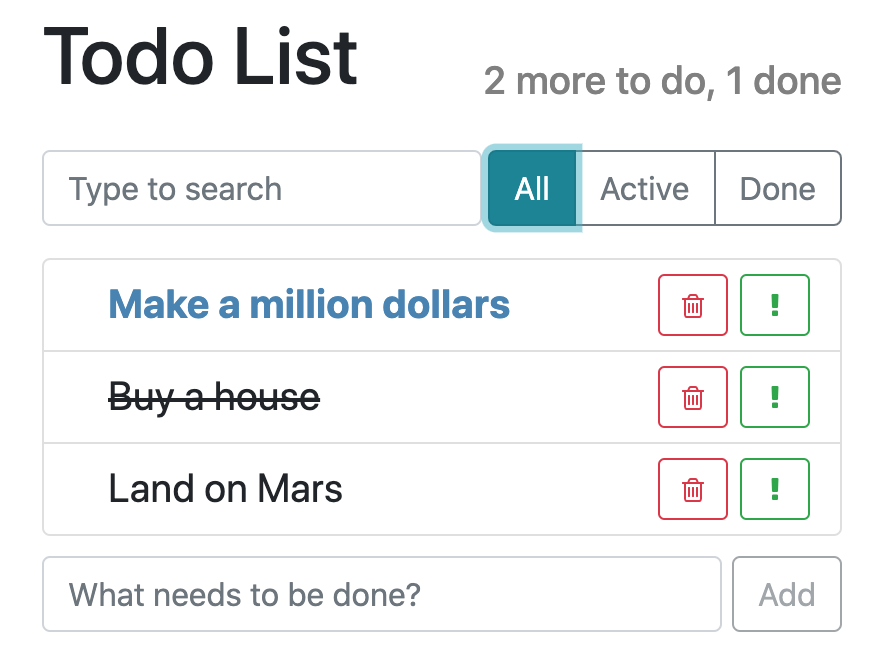

# todo app

# [Demo](https://todo-shakshin.netlify.app/)

Configure your own list with deals you need to do!
The project was written in React.


## Running

```bash

git clone https://github.com/shakshin-01/todo
npm install
npm start
```

## Features

There are lots of things you can do:

- add
- delete
- search
- filter
- mark as important or done
